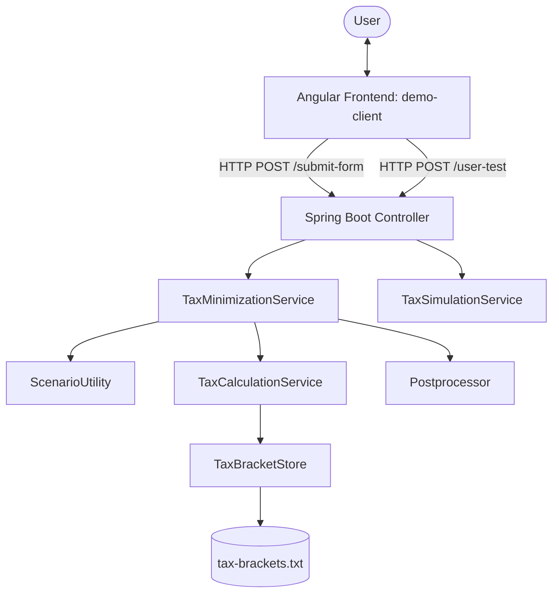

# Nest Egg Optimizer - System Documentation

The **Nest Egg Optimizer** is a full-stack application designed to model, simulate, and optimize retirement portfolio withdrawals. It helps users determine the most tax-efficient sequence and ratio of withdrawals from various account types (Tax-Free, Tax-Deferred, and Taxable) to maximize the longevity of their retirement nest egg.

---

## 🗺️ Repository Layout

The repository is organized as a monorepo containing the following components:

- **`demo/`**: Spring Boot (Java 17) backend service. Exposes REST API endpoints and contains the tax calculation, portfolio simulation, and withdrawal optimization engine.
- **`demo-client/`**: Angular frontend client. Displays forms for user financial inputs and utilizes Chart.js to render interactive charts of portfolio burndown scenarios.
- **`start-backend.ps1`**: PowerShell script to start the backend with Maven.
- **`start-frontend.ps1`**: PowerShell script to install dependencies and run the Angular frontend client.

---

## ⚙️ Architecture & Components



### 1. Spring Boot Backend (`demo/`)

The backend is built with Spring Boot and manages the mathematical modeling, tax logic, and recursive search optimization.

*   **`DemoApplication.java`**: Main application entry point. Starts the embedded Tomcat server on port `8081`.
*   **`Controller.java`**: Exposes REST endpoints, parses input forms, maps parameters to domain models, and invokes optimization/simulation services.
*   **`FinanceUtility.java`**: Standard financial formulas:
    *   `calcYearsUntilDepletion`: Simulates account depletion under interest growth and constant annual withdrawals.
    *   `calcFinalValue`: Calculates the future value of an account over a fractional or whole number of years.
*   **`TaxCalculationService.java`**: The core tax engine:
    *   Loads tax brackets from `tax-brackets.txt` on startup.
    *   Contains helper methods to calculate pre-tax and post-tax income amounts under federal and Ontario tax rules.
    *   Uses a numerical inversion loop (iterative guess/tolerance checks) to determine the exact pre-tax withdrawal required to meet a post-tax target.
*   **`TaxMinimizationService.java`**: Optimization coordinator. Searches for the withdrawal allocation that yields the highest total depletion age.
*   **`TaxSimulationService.java`**: Evaluates account balances year-by-year based on user-defined withdrawal amounts.
*   **`Postprocessor.java`**: Generates a timeline of year-by-year state events (`BurndownTimeEvent`) capturing principal, capital gains, taxes paid, and remaining balances.

### 2. Angular Frontend (`demo-client/`)

The frontend application provides a dashboard for entering inputs and visualizing outputs.

*   **`UserInputComponent`** (`src/app/userinput/`): Collects retirement assets (TFSA, RRSP, Margin account principal/gains), annual income, interest rate, and required annual spending. When values change, it notifies components that the current chart is obsolete, greying it out until recalculated.
*   **`DisplaywindowComponent`** (`src/app/displaywindow/`): A tabbed container switching between:
    *   *Optimal Strategy*: Showcases the recommended withdrawal ratio (e.g. stage 1: TFSA 30%, RRSP 70%) and displays the portfolio burndown chart.
    *   *Test Strategy*: Visualizes manual strategy testing.
    *   *Monte Carlo Sims*: Shows the distribution of outcomes under random return rates.
*   **`ChartComponent`** (`src/app/chart/`): Configures and draws line graphs using Chart.js based on backend results.
*   **`SharedDataService`** & **`SharedService`** (`src/app/services/`): Handles state sharing, event emission, and reactive communication between the input form, tabs, and chart canvas.

---

## 📈 Optimization Algorithm

The primary goal of the optimizer is to maximize the time before the portfolio depletes. It uses a **recursive multi-stage grid-search** algorithm:

1.  **Permutation Generation**: Generates combinations of withdrawal percentages across accounts. For example, if there are 3 accounts (TFSA, RRSP, Taxable/Margin) and `intervalSize = 2`, it checks permutations of `[0.0, 0.0, 1.0]`, `[0.5, 0.5, 0.0]`, `[0.0, 1.0, 0.0]`, etc., where the sum equals 100%.
2.  **Simulation & Chronological Splitting**: For each percentage permutation:
    *   It simulates the portfolio forward.
    *   Since different accounts deplete at different rates, the first account will eventually hit $0.
    *   The year this first account empties is recorded as `yearsToFirstAccountDepletion`.
3.  **Recursive Optimization (Next Stage)**:
    *   Once an account depletes, the problem size shrinks (e.g., from 3 accounts to 2).
    *   The program updates the balances of the remaining accounts at the moment of depletion.
    *   It recursively spawns a child `ScenarioNode` to optimize the remaining portfolio.
    *   The total years to depletion is the sum of the years spent in each stage.
4.  **Local Refinement (Shrinking Window)**:
    *   Rather than doing a heavy brute-force search over massive permutations, the optimizer starts with a coarse grid (low `intervalSize`).
    *   It finds the best candidate, centers a smaller search window ("optimization window") around it, increases grid resolution, and repeats. This mimics a gradient-free local search.

---

## 💵 Tax Logic & Account Types

The system simulates three main types of accounts, each with distinct tax treatments:

| Account Type | Description | Tax Treatment on Withdrawal |
| :--- | :--- | :--- |
| **TFSA (Tax-Free Savings Account)** | Tax-free savings vehicle. | 100% Tax-Free. Withdrawals do not affect taxable income. |
| **RRSP (Registered Retirement Savings Plan)** | Tax-deferred retirement plan. | 100% Taxable. Treated as regular earned income. |
| **MARG (Margin / Non-Registered Taxable)** | Taxable brokerage account. | Capital gains are partially taxable. Only `capitalGainsTaxablePercentage` (default 50%) of the gain portion is included in taxable income. Principal is returned tax-free. |

### Tax Calculation Method
Taxes are computed at the federal level and provincial level:
*   **Provincial Basic Personal Amount**: $11,865 (Ontario)
*   **Federal Basic Personal Amount**: $15,000 (Canada)
*   Income below basic personal amounts is not taxed.
*   The backend splits taxable income and applies progressive marginal rates stored in `tax-brackets.txt`.
*   **Reverse Tax Calculation**: Because the user specifies the *after-tax* spending they need, the system must perform a reverse search to figure out how much *pre-tax* dollars to take out to yield that spending after tax. This is accomplished in `TaxCalculationService.calculatePreTaxAmount` through an iterative approximation loop.

---

## 📡 API Endpoints

The backend runs on port `8081` and supports CORS for requests from the frontend client.

### `GET /hello`
Returns a plain-text verification string: `"Hello, World!"`.

### `GET /all`
Reads and returns all configured tax brackets.

### `POST /submit-form`
Submits starting financial details to find the optimal strategy.
*   **Request Payload**: `FormData`
    ```json
    {
      "tfsaAmount": 500000,
      "rrspAmount": 650000,
      "income": 5000,
      "margAmountPrincipal": 500000,
      "margAmountCapitalGain": 500000,
      "interestRate": 0.04,
      "amountPerYear": 75000,
      "province": "Ontario"
    }
    ```
*   **Response Payload**: Array of `BurndownTimeEvent` representing the optimal strategy burndown timeline.

### `POST /user-test`
Simulates a manual strategy based on explicit withdrawal amounts.
*   **Request Payload**: `UserTestFormData`
    ```json
    {
      "tfsaAmount": 500000,
      "rrspAmount": 650000,
      "income": 5000,
      "margAmountPrincipal": 500000,
      "margAmountCapitalGain": 500000,
      "interestRate": 0.04,
      "startingYear": 0,
      "tfsaWithdraw": 20000,
      "rrspWithdraw": 30000,
      "margWithdraw": 25000
    }
    ```
*   **Response Payload**: Array of `BurndownTimeEvent` representing the simulated scenario.

---

## 🚀 Running the Application

### 1. Prerequisites
Ensure you have installed:
*   Java 17 SDK
*   Node.js (LTS version recommended) & npm

### 2. Start the Backend
Execute the PowerShell script at the root directory:
```powershell
./start-backend.ps1
```
This runs the Maven wrapper script to start the Spring Boot app. The server runs at `http://localhost:8081`.

### 3. Start the Frontend
Execute the PowerShell script at the root directory:
```powershell
./start-frontend.ps1
```
This script runs `npm install` (if `node_modules` is missing or the `-Install` flag is supplied) and starts the Angular server on `http://localhost:4200`.
